# 在 OpenShift & OpenShift AI 上部署 SGLang+DeepSeek 大模型实现分布式推理：完整指南

## **1. 前言**

近年来，大语言模型（LLM）成为 AI 领域的核心技术，**DeepSeek** 作为国产领先的大模型之一，凭借其强大的推理能力和高效的架构，受到了广泛关注。所以，很多客户现在都在考虑如何充分利用DeepSeek实现更多的AI能力，为企业业务增长赋能。如何选择适合生产级的DeepSeek推理解决方案，并在其上进行部署，是本文要阐述的问题之一。

**SGLang** 作为一款轻量级、高效的 LLM 应用开发框架，为开发者提供了便捷的 API 及推理部署能力。

与此同时 **OpenShift** 及其 AI 组件 **OpenShift AI**（基于 Open Data Hub）提供了强大的 AI 工作负载管理能力，使得部署和扩展 LLM 变得更加高效。

本篇文章的大部分内容来自于客户真实场景的最佳实践，将带你手把手完成 **SGLang + DeepSeek** 大模型在 **OpenShift & OpenShift AI** 上的部署，让你快速搭建属于自己的 AI 交互服务。

同时，对于某些场景的需要，比如多机多卡，本文提供了实现**分布式推理**的相关步骤实现。

## 2. SGLang 、DeepSeek，OpenShift 和OpenShift AI

### 2.1 SGLang简介

当前最主流的开源推理框架有很多，包括Ollama、vLLM、HuggingFace TGI、SGLang等。其中SGLang 是一个专为 LLM（大语言模型）设计的高效开发框架，具备以下特点：
✅ 快速后端运行时：通过RadixAttention提供高效服务，用于前缀缓存、前跳约束解码、无开销CPU调度器、连续批处理、Token注意力（paged attention）、张量并行性、FlashInfer内核、分块前缀填充和量化（FP8/INT4/AWQ/GPTQ）。
✅ 灵活的前端语言：为LLM应用程序编程提供了一个直观的接口，包括链式生成调用、高级提示、控制流、多模态输入、并行性和外部交互。
✅ 广泛的模型支持：支持各种生成模型（Llama、Gemma、Mistral、QWen、DeepSeek、LLaVA等）、嵌入模型（e5-Mistral、gte）和奖励模型（Skywork），易于扩展以集成新模型。

### 2.2 DeepSeek简介

DeepSeek 是国内领先的大模型之一，在中文理解和推理方面表现优异。相比于 OpenAI 的 GPT 系列，DeepSeek 在**本地化适配、代码生成、数学推理**等方面表现突出，适合开发各种智能应用。

DeepSeek当前主要包括V3和R1两个大系列版本。

其中的**V3版本是通用型的大语言模型**，重点在于可扩展性和高效处理，目标是在多种自然语言处理任务中实现高效、灵活的应用。V3版本在数学、多语言任务以及编码任务中表现优秀。V3版本适用于大规模自然语言处理任务，如对话式AI、多语言翻译和内容生成等，能够为企业提供高效的AI解决方案，满足多领域的应用需求。

DeepSeek的**“满血”模型**为671B参数，至少需要**8张96GB**的显卡才能满足需要。

DeepSeek V3模型下载，https://huggingface.co/deepseek-ai/：

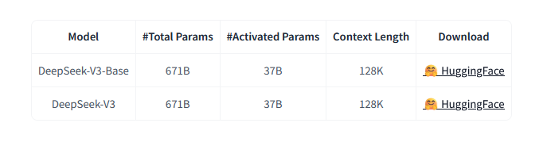

**DeepSeek-R1 是推理优先的模型**，侧重于处理复杂的推理任务，为需要深度逻辑分析和问题解决的场景而设计。在需要逻辑思维的基准测试中表现出色，在数学、代码和推理任务中实现了与 OpenAI-o1 相当的性能。为了支持研究社区，厂商开源了 DeepSeek-R1-Zero、DeepSeek-R1 以及基于 Llama 和 Qwen 从 DeepSeek-R1 中提炼出的六个密集模型。 DeepSeek-R1-Distill-Qwen-32B 在各种基准测试中均优于 OpenAI-o1-mini，为密集模型取得了新的最先进成果。

为了进行技术验证节省资源，本文选择deepseek-ai/DeepSeek-R1-Distill-Qwen-7B 蒸馏模型进行测试。该蒸馏模型在计算资源的需求上得到了优化，既能保证性能，又能适应现有硬件的限制。当然，如果条件许可，建议采用deepseek-ai/DeepSeek-R1-Distill-Qwen-32B甚至满血模型，如下图：


------

### 2.3 OpenShift 进行 LLM 高可用部署和推理

在当前的 AI 及大模型（LLM）应用浪潮中，企业越来越需要高效、可扩展、安全的基础设施来支持 AI 模型的开发、训练和推理。传统的物理机或者虚拟化基础设施，在运维和自动化等方面越来越不如容器平台给客户带来更多便捷性和增值服务。而 OpenShift 作为基于 Kubernetes（K8s） 的企业级容器平台，提供了一整套 AI/ML 解决方案，特别适合大语言模型（LLM）及 AI 负载的部署与管理。

Operator提供了一种打包、部署和管理其Kubernetes应用程序的方法，简化了客户管理的应用程序的安装和持续维护。例如NVIDIA GPU Operator自动管理在Kubernetes集群上配置GPU所需的所有NVIDIA软件组件。NVIDIA GPU Operator使向OpenShift添加GPU资源成为集群运维管理员的一个优选。这使得客户在部署诸如大模型类的模块时，无需耗费精力安装、运维后台显卡的各种复杂驱动及版本配置。

OpenShift运维Nvidia驱动与传统的异同如下图：

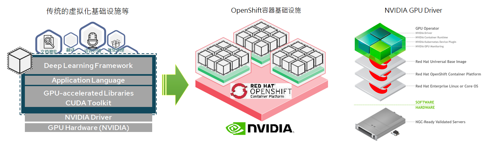


### 2.4  统一算力，模型管理，训练发布平台：OpenShift AI

在 AI/LLM（大语言模型）时代，企业级 AI 解决方案需要**强大的计算能力、稳定的部署环境、自动化管理能力**，以及**数据安全合规性**。**OpenShift AI**（基于 **Open Data Hub**）为企业提供了一套**端到端的 AI/ML 平台**，适用于模型训练、推理、MLOps 和 AI 应用部署：

✅ **适用于企业级 AI/ML 工作负载**
✅ **支持 GPU 加速 & 自动扩展**
✅ **提供 MLOps（AI 训练 + 推理 + 监控）**
✅ **兼容 Kubernetes 生态（Kubeflow、Ray、MLflow）**
✅ **支持 DevOps/GitOps 自动化 AI 部署**

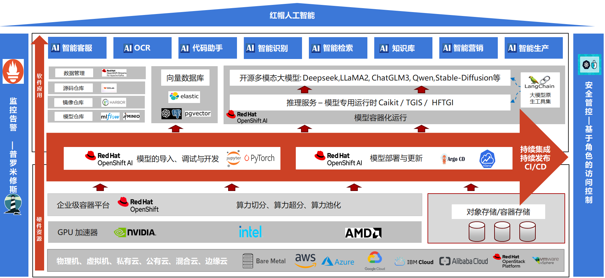

OpenShift AI 兼容**主流 AI 框架**，并集成了**多种 AI 组件**，形成完整的 AI/LLM 生态：

| 组件                  | 作用                    |
| --------------------- | ----------------------- |
| Jupyter Notebook      | 交互式  AI 开发环境     |
| Kubeflow              | AI  训练 & MLOps        |
| KServe（KFServing）   | LLM  & AI 模型推理      |
| NVIDIA GPU Operator   | GPU  资源管理           |
| MLflow                | AI  模型管理 & 版本控制 |
| ArgoCD / Tekton       | DevOps  & GitOps        |
| Service Mesh（Istio） | AI  负载的安全管理      |

## 3. 在 OpenShift 上部署 SGLang + DeepSeek

在大模型（如 GPT-4、Llama、DeepSeek）部署方面，**OpenShift** 相较于 **传统基础设施（裸机服务器、VM 虚拟机等）** 具有明显的优势，尤其在 **灵活性、自动化、资源管理、多云支持** 方面。

相比传统裸机/VM，OpenShift 更适用于以下客户场景。

| 客户类型                            | 需求特点                                                 | 推荐产品      |
| ----------------------------------- | -------------------------------------------------------- | ------------- |
| 大模型  SaaS 企业（AI API 提供商）  | 需要 AI  推理 API，支持自动扩展，降低计算成本            | 🏆 OpenShift   |
| 金融行业（银行、证券、保险）        | 需要 私有化  AI 风控、交易 AI、量化 AI                   | 🏆 OpenShift   |
| 制造、医疗行业（医学影像  AI, NLP） | 需要 合规、安全的私有  AI 训练 & 影像 AI                 | 🏆 OpenShift   |
| 仅运行少量  AI 任务的企业           | 主要运行 单机  AI 训练 & 推理，无需 Kubernetes/OpenShift | ✅ 传统裸机/VM |

除此之外，OpenShift对AI、大模型的支持优势还有：

| 优势              | 说明                                                         |
| ----------------- | ------------------------------------------------------------ |
| 企业级 Kubernetes | 提供更稳定、安全、可扩展的  AI 部署环境                      |
| GPU 计算支持      | 轻松管理  NVIDIA GPU 资源，实现 AI 计算加速，自动调度 GPU 资源，避免 GPU 计算资源浪费， 支持多租户 GPU 分配，让不同 AI 团队共享 GPU 计算能力 |
| 自动扩展          | 根据流量需求自动调整计算资源                                 |
| 安全 & 合规       | 企业在部署 LLM 时，需要考虑数据安全、访问控制、合规性等问题  |
| Operator 生态     | 轻松集成  AI/ML 工具，如 NVIDIA GPU Operator，TensorFlow、PyTorch、Kubeflow |
| GitOps & DevOps   | 结合  CI/CD 流水线，进行 AI 应用的自动部署，实现 AI 应用快速更新，版本控制 + 自动回滚，避免 AI 应用故障 |

在 AI 时代，大模型（LLM）和 AI 计算需求持续增长，而 **OpenShift** 通过 Kubernetes 强化、GPU 加速、自动扩展、MLOps 生态等特性，成为企业部署 AI/LLM 应用的**理想平台**。如果你希望在企业级环境中高效、安全地运行 **DeepSeek、Llama、ChatGLM** 等大模型，OpenShift 无疑是**最佳选择之一**。

### 3.1 准备好 OpenShift

要运行SGLang容器，首先需要一个OpenShift容器平台，这里不再赘述，详细资料可查询官方网站：https://docs.openshift.com/

在本地堡垒机或者操作台，确保你已经安装了 OpenShift CLI（`oc`）并登录 OpenShift 集群：

```
# 登录 OpenShift
oc login --token=<your-token> --server=<your-openshift-api-url>

# 创建或者切换到目标项目（Namespace）
oc new-project deepseek-test
```

### 3.2 准备SGLang 以及DeepSeek 大模型

在 OpenShift 上，我们需要将 SGLang 和 DeepSeek 封装为一个 容器（Pod），然后暴露成 服务（Service）。

#### (1) 从官方社区拉取镜像

```
podman pull docker.io/lmsysorg/sglang:latest
```

由于docker.io的拉取次数被限制，所以建议另存到其它镜像仓库。如果你有红帽官网账号，建议使用quay.io镜像仓库。

#### (2) 推送镜像到新镜像仓库

```
# 登录 quay.io公共镜像库，或者内部镜像仓库
podman login quay.io

# 推送到 镜像仓库
podman tag docker.io/lmsysorg/sglang:latest quay.io/howang/sglang:latest
docker push quay.io/howang/sglang:latest
```

浏览器打开quay.io，登录你的账号。（如果没有quay.io账号，可使用内部镜像仓库或者其它公有云仓库）

为了便于使用，建议将该镜像设置为public可访问。

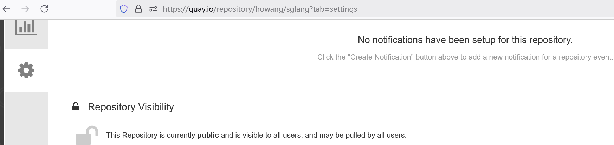


#### (3) 准备DeepSeek大模型

SGLang支持在线拉取大模型，但是在实际工作场合，一般需要提前把大模型下载下来，存放到共享存储或者制品库某个地方。

为了便于Openshift使用，本文采取把大模型存入PV（Persistent Volume）的方式，节省部署和调试的时间。

🔹首先，创建一个PVC：

```
apiVersion: v1
kind: PersistentVolumeClaim
metadata:
  name: ds-models-cache
spec:
  accessModes:
  - ReadWriteOnce
  resources:
    requests:
      storage: 500Gi
  volumeMode: Filesystem
```

🔹再创建一个便宜的pod

```
apiVersion: v1
kind: Pod
metadata:
  name: pod-with-pv
spec:
  containers:
    - name: my-container
      image: nginx:latest
      volumeMounts:
        - mountPath: /models
          name: my-pv
  volumes:
    - name: my-pv
      persistentVolumeClaim:
        claimName: ds-models-cache
```

pod成功创建后，会自动挂载该PVC，并且自动创建PV（可能取决于你环境中的StorageClass配置）

🔹然后，把大模型拷贝进PV

```
oc cp ./DeepSeek-R1-Distill-Qwen-7B deepseek-test/pod-with-pv:/models/
```

注意，我们创建pod只是利用一下，然后就可以删掉了，所以，在删掉pod之前，需要确认pv的persistentVolumeReclaimPolicy是Retain的，这样删除pod时，pv还会保留数据。

```
####将pv改为删除保留
oc patch pv pvc-73649058-e3e9-40db-b153-26b6174bb6c6 -p '{"spec":{"persistentVolumeReclaimPolicy":"Retain"}}'
```

🔹最后，你就可以删掉刚创建的这个pod了。

#### (4) 大模型置备选项

大模型要想在OpenShift平台中使用，一般可以选择以下手段：

★ 创建一个临时Pod的方式，手动复制上传到PV。

★ 直接把大语言模型打包到镜像中一体使用。

★ 使用S3 cli工具，将大模型文件上传到本地对象存储中备用。

★ 红帽官网还提供了专门的模型下载Pod，详见链接：https://docs.redhat.com/en/documentation/red_hat_openshift_ai_cloud_service/1/html-single/serving_models/index#deploying-models-using-multiple-gpu-nodes_serving-large-models

#### (5) 大模型推理对资源需求考量

一般情况下，模型参数所耗费的显存和内存的配置如下表，我们在使用大模型之前，可以先掂量一下手里的存货再继续（精度不同，对显存的使用也很大不同，以下以float16推理为例）：

| 模型参数 | CPU Core | 内存 GB | 显存 GB | 其它         |
| -------- | -------- | ------- | ------- | ------------ |
| 1.5B     | 4        | 8       | 4       |              |
| 7B       | 8        | 16      | 8       |              |
| 8B       | 8        | 16      | 16      |              |
| 14B      | 12       | 32      | 16      |              |
| 32B      | 16       | 64      | 40      |              |
| 70B      | 32       | 128     | 80      | 考虑多卡并行 |
| 671B     | 64       | 512     | 768     | 考虑多机多卡 |

有一个估算GPU内存使用量的网站，可以尝试一下：https://modelscope.cn/studios/AlphaHinex/model-memory-usage


### 3.3 在 OpenShift 部署Deployment

(1) 创建 Deployment

🔹编写 deployment.yaml：

```
kind: Deployment
apiVersion: apps/v1
metadata:
  name: deepseek-standalone
spec:
  replicas: 1
  selector:
    matchLabels:
      app: deepseek-standalone
  template:
    metadata:
      creationTimestamp: null
      labels:
        app: deepseek-standalone
    spec:
      volumes:
        - name: dshm
          emptyDir:
            medium: Memory
        - name: model
          persistentVolumeClaim:
            claimName: ds-models-cache
      containers:
        - name: sglang-leader
          image: quay.io/howang/sglang:latest
          securityContext:
            privileged: true
          env:
            - name: NCCL_IB_GID_INDEX
              value: "3"
          command:
            - python3
            - -m
            - sglang.launch_server
            - --model-path
            - /root/.cache/huggingface/DeepSeek-R1-Distill-Qwen-7B
            - --mem-fraction-static
            -  "0.93"
            - --torch-compile-max-bs
            - "8"
            - --max-running-requests
            - "20"
            - --tp
            - "1" # Size of Tensor Parallelism
            - --trust-remote-code
            - --host
            - "0.0.0.0"
            - --port
            - "40000"
          resources:
            limits:
              nvidia.com/gpu: "1"
          ports:
            - containerPort: 40000
          volumeMounts:
            - mountPath: /dev/shm
              name: dshm
            - name: model
              mountPath: /root/.cache/huggingface
```

这里要注意的地方时，mountPath以及--model-path参数的路径，结合上一步oc cp命令，把正确的路径信息拼出来。

🔹部署应用：

```
oc apply -f deployment.yaml
```

结果可以看到SGLang能够正常启动并且加载大模型，如下图

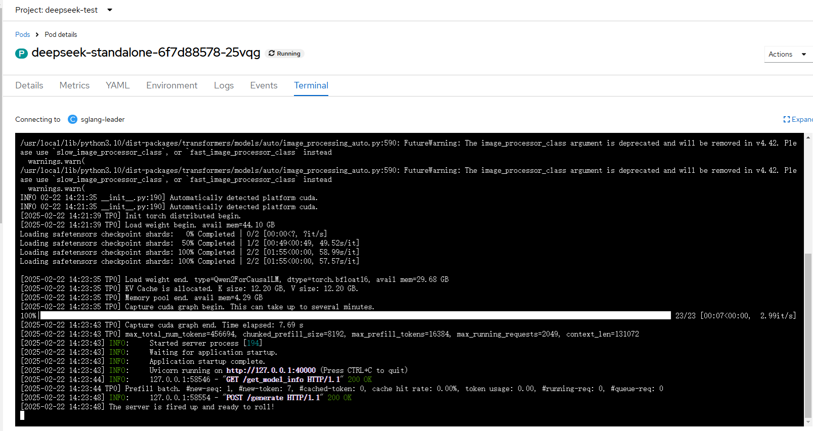

比较容易出错的地方有2处，一个是路径拼错，另外一个时SGLang需要特权容器，所以这个参数需要明确存在：privileged: true。

```
###同时，给namespace赋权
oc adm  policy add-scc-to-user privileged -z default -n deepseek-test
```

🔹最后，为了让外部应用访问 AI 推理服务，我们需要创建一个 Service和一个Route（略）

### 3.4 测试大模型推理

你可以用 curl 进行测试：

```
curl http://localhost:40000/v1/completions \
-H "Content-Type: application/json" \
-d '{
    "model": "DeepSeek-R1-Distill-Qwen-7B",
    "role": "user",
    "prompt": "What is the meaning of life?"
}'
```

可以看到结果是很OK的。

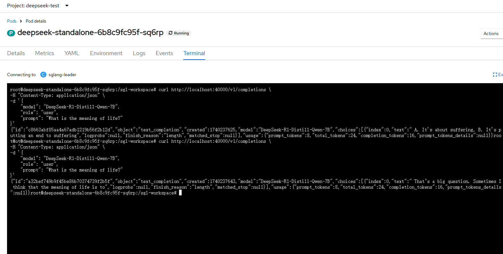

此时，我们可以充分利用OpenShift的扩缩特性，增加Deployment的副本数量，就可以多机多卡的高可用推理了。


## 4. 部署进阶1：在 OpenShift AI 上部署 

除了在OpenShift标准环境中部署LLM（大语言模型）之外，我们还可以考虑OpenShift AI部署LLM（大模型）。

✅ 如果你的角色是AI研发团队，建议选择OpenShift AI

✅ 如果企业有大模型训练、Fine-tuning 或大规模推理需求，OpenShift AI 是更优选择

✅ 如果你除了部署大模型之外，还希望使用**Ray 或者MPI 分布式计算**等场景，建议使用OpenShift AI

在 OpenShift AI 上，可以除了可以**高效地部署和管理 LLM（如 DeepSeek、Llama、ChatGLM）**，还具有以下优势：

| 需求                | OpenShift AI  解决方案                                       |
| ------------------- | ------------------------------------------------------------ |
| 高效 LLM 训练       | 内置 Jupyter Notebook：支持 TensorFlow、PyTorch、DeepSeek 等框架 ，自动 GPU 资源管理：集成 NVIDIA GPU Operator，提升 AI 计算效率 ，支持分布式训练：通过 Kubeflow、Ray 进行高性能 AI 训练。 **适用场景**：AI 研究、DeepSeek/GPT 训练、分布式大模型训练 |
| 大模型推理          | NVIDIA GPU Operator：自动管理 GPU 资源，优化计算性能，GPU 任务调度：动态分配 GPU 计算资源，避免资源浪费。适用场景：大模型推理（Llama、DeepSeek）、AI 计算密集型任务 |
| 自动扩展 & 负载均衡 | HPA（Horizontal Pod Autoscaler）：自动扩展 AI 计算节点,Cluster Autoscaler：动态调整 GPU 计算资源,KServe（KFServing）：轻松扩展 AI 推理服务. **适用场景**：在线 AI API、AI SaaS 应用、AI 推理服务 |
| 企业级安全与合规    | OpenShift  Service Mesh + RBAC,内置 TLS 加密 & 网络隔离**, **符合 SOC 2、ISO 27001、GDPR 等企业安全标准 |
| 强大的 MLOps 支持   | Kubeflow Pipelines：可视化管理 AI 训练流程, MLflow：自动化模型管理与版本控制, ArgoCD + GitOps：自动化 AI 应用的 CI/CD 部署;**适用场景**：AI 生产环境、企业 AI 运维、模型自动更新 |

### 4.1 安装 NFD, NVidia, Service Mesh, Serverless

首先部署一套支持安装OpenShift AI（OAI）的OCP集群。

其次，按照顺序，执行以下步骤：

🔹授权OAI管理账户

登录OCP集群，创建一个rhods-admins用户组，并把管理员用户admin加入（admin将作为OAI的管理用户）

以下是在OCP4.16/4.17版本下，

🔹安装NFD Operator

🔹安装NVidia GPU Operator

🔹安装OpenShift Elasticsearch Operator，

🔹安装Kiali Operator， provided by Red Hat，

🔹安装Red Hat OpenShift distributed tracing platform (Jaeger)

🔹安装ServiceMesh Operator，安装后，不要创建任何配置。

https://docs.openshift.com/container-platform/4.16/service_mesh/v2x/installing-ossm.html#ossm-install-ossm-operator_installing-ossm

🔹安装Serverless Operator，安装后，不要创建任何配置

https://docs.openshift.com/serverless/1.32/install/install-serverless-operator.html


### 4.2 部署 OpenShift AI

🔹之前的所有准备工作都齐备后，就可以安装Red hat Openshift AI operator了。

https://docs.redhat.com/en/documentation/red_hat_openshift_ai_self-managed/2.16/html/installing_and_uninstalling_openshift_ai_self-managed/installing-and-deploying-openshift-ai_install#installing-openshift-ai-operator-using-web-console_operator-install

🔹安装完成后，当然还需要创建必须要的**DSC Initialization**对象，这里不再赘述。

详细文档可参考：https://docs.redhat.com/en/documentation/red_hat_openshift_ai_self-managed/2.16/html/serving_models/serving-large-models_serving-large-models#deploying-models-on-single-node-openshift-using-kserve-raw-deployment-mode_serving-large-models

DSC（DataScienceCluster）示例如下：

```
spec:
  components:
    codeflare:
      managementState: Managed
    kserve:
      defaultDeploymentMode: RawDeployment
      managementState: Managed
      serving:
        ingressGateway:
          certificate:
            type: OpenshiftDefaultIngress
        managementState: Removed
        name: knative-serving
```

此时，你可以通过 OpenShift Web 控制台访问 OpenShift AI Dashboard 并创建 Notebook 或 AI 服务。


### 4.3 使用Kserve框架

KServe是一个开源的云原生模型服务平台，旨在简化在Kubernetes上部署和运行机器学习模型的过程，支持多种机器学习框架、具备弹性扩容能力。KServe通过定义简单的YAML文件，提供声明式的API来部署模型，使得配置和管理模型服务变得更加容易。

KServe提供了一系列自定义资源（CRD），用于管理和提供机器学习模型的服务。并针对TensorFlow、XGBoost、scikit-learn、PyTorch和Huggingface Transformer/LLM等模型，必要时，可以自定义Custom ModelServer。

KServe提供了易用的高级接口及标准化的数据平面协议。此外，KServe屏蔽了自动扩缩（AutoScaling）、网络、健康检查和服务器配置的复杂操作，实现了GPU的自动扩缩，并借助Serverless能力，提供按需扩缩至零（Scale to Zero）功能以及灰度发布能力（Canary Rollouts），简化了AI模型的部署和维护流程。

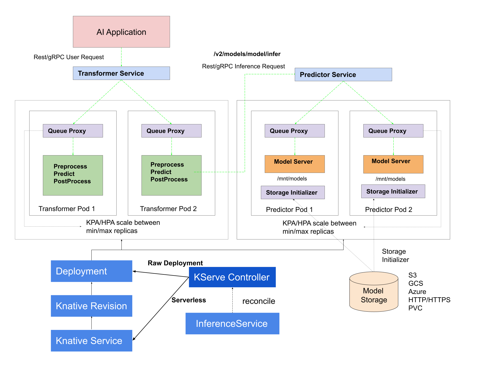

总的来说，KServe具有以下优势：

✅ KServe是Kubernetes上的标准模型推理平台，专为高度可扩展的用例而构建。
✅ 跨ML框架提供高性能、标准化的推理协议。
✅ 支持现代无服务器推理工作负载，具有自动缩放功能，包括在GPU上缩放到零。
✅ 使用ModelMesh提供高可扩展性、密度封装和智能布线
✅ 简单易插的生产服务，用于生产机器学习服务，包括预测、前/后处理、监控和可解释性。
✅ 通过多种高级部署方式，如：金丝雀部署、experiments, ensembles 和 transformers。

默认情况下，可以使用**无服务器模式**进行大模型部署，无服务器模式通过OpenShift Serverless在KServe的 single-model 服务平台上部署模型，这是一种允许无服务器部署模型的云原生开发模型。OpenShift Serverless基于开源的Knative项目。
或者，您可以使用**raw deployment模式**，该模式不依赖于OpenShift Serverless Operator。使用raw deployment模式，您可以使用Kubernetes资源部署模型，如Deployment，Service，Ingress和Horizontal Pod Autoscaler。

**为了节省资源，本文章，使用raw deployment部署大模型。**


### 4.4 准备DeepSeek大模型

在前面的Openshift部署方式中，我们将下载的大模型提前手动复制到一个PV中，这种方式如果需要频繁的大模型版本变更或者维护时非常的麻烦，所以，下面，我们使用S3对象存储集中存放所需的大模型。

这里，**我们会用到KServe框架中的Storage Initializer功能，它会将S3存储中存放的模型，自动复制到/mnt/models目录供Model Server加载**。明白这个原理便于您理解后续的操作步骤。

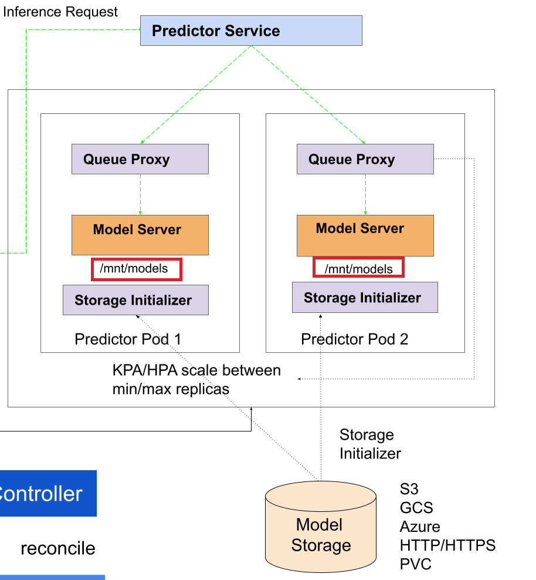

#### (1) 使用Jupyter lab下载所需的大模型

有了OpenShift AI平台，你会发现使用平台提供的Jupyter Notebook交互式AI开发功能非常方便，这里，我们直接在Notebook里写下下述关键脚本实现所需大模型的下载。

```
MODEL_NAME = os.environ.get('model_name', 'deepseek-ai/DeepSeek-R1-Distill-Qwen-7B')
COMPONENT_NAME = os.environ.get('component_name', 'deepseek-ai/DeepSeek-R1-Distill-Qwen-7B')
dummymodel = torch.nn.Linear(100,200)
os.environ['MLFLOW_HTTP_REQUEST_TIMEOUT']=str(9999)
logging.getLogger(\"mlflow\").setLevel(logging.DEBUG)
os.environ['HF_ENDPOINT']='https://hf-mirror.com'
EXCLUDE_SUFF = os.environ.get('exclude_suffix', '*.dummy')
####从huggingface中下载模型
!huggingface-cli download --exclude {EXCLUDE_SUFF} --resume-download --local-dir-use-symlinks False --local-dir {COMPONENT_NAME} {MODEL_NAME}
```

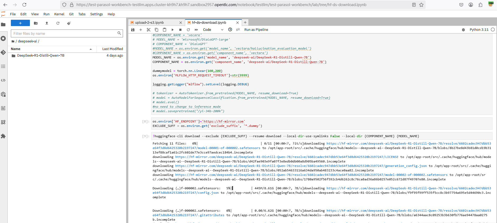

#### (2) 将下载的大模型上传至S3中

同样的，我们把下载的大模型直接在Jupyter Notebook里上传至S3存储中。

```
import botocore
import os
from boto3.session import Session
   
aws_access_key_id = 'openshift'
aws_secret_access_key = 'openshift'
session = Session(aws_access_key_id=aws_access_key_id, aws_secret_access_key=aws_secret_access_key)
# s3 session
s3 = session.resource('s3', endpoint_url='http://minio-svc.minio-store.svc.cluster.local:9000')
    
bucket = s3.Bucket(\"openshift\")
####遍历当前目录，把其中的所有文件上传至s3对象存储    
for filename in os.listdir(directory):
    f = os.path.join(directory, filename)
        # checking if it is a file
    if os.path.isfile(f):
       with open(f, 'rb') as data:
         objkey = \"/mymodel/\"+f
         print(objkey[1:])
         bucket.put_object(Key=objkey[1:], Body=data)
```

🔹执行上述脚本，可以非常直观的观测到模型文件上传过程。

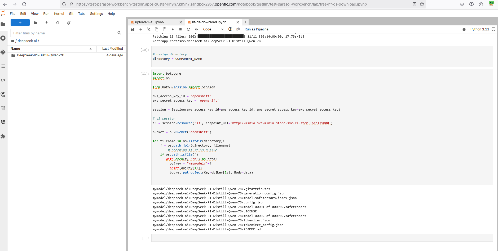

🔹在S3平台中，记住大模型的存放位置（比如这里是/mymodels/deepseek-ai/DeepSeek-R1-Distill-Qwen-7B)：

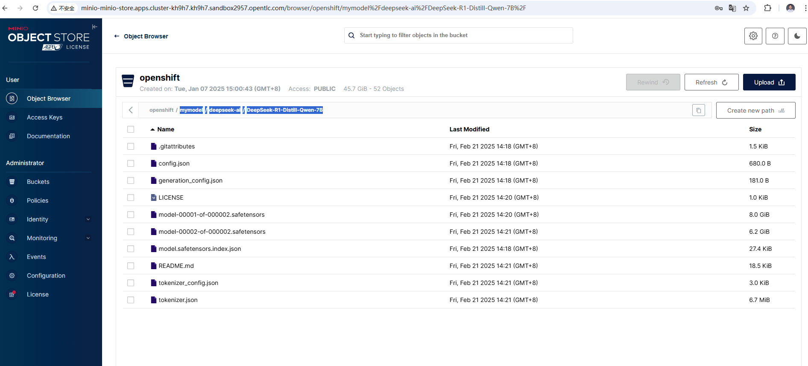

### 4.5 创建一个自定义KServe Runtime

Runtime的作用，就好像一个中间件，大模型就好像运行在其中的业务应用。

这里需要注意的地方有：--model-path参数要指向/mnt/models，因为根据前面架构图所示，KServe会自动从S3中复制大模型文件到该目录。

再就是不要忘了把下面的超级权限加到Runtime中。

```
          securityContext:
            privileged: true
####或者，修改home变量
          -name: HOME
            value: /tmp
```

🔹整个yaml内容如下：

```
apiVersion: serving.kserve.io/v1alpha1
kind: ServingRuntime
metadata:
  annotations:
    opendatahub.io/recommended-accelerators: '["nvidia.com/gpu"]'
    openshift.io/display-name: SGLang ServingRuntime for KServe
  labels:
    opendatahub.io/dashboard: "true"
  name: sglang-runtime-raw-gui
spec:
  annotations:
    prometheus.io/path: /metrics
    prometheus.io/port: "8080"
  containers:
    - args:
        - -m
        - sglang.launch_server
        - --model-path
        - /mnt/models
        - --mem-fraction-static
        - "0.93"
        - --torch-compile-max-bs
        - "8"
        - --max-running-requests
        - "20"
        - --tp
        - "1"
        - --trust-remote-code
        - --host
        - 0.0.0.0
        - --port
        - "40000"
      command:
        - python3
      env:
        - name: HF_HOME
          value: /tmp/hf_home
        -name: HOME
          value: /tmp
      securityContext:
        privileged: true
      image: quay.io/howang/sglang:latest
      name: kserve-container
      ports:
        - containerPort: 40000
          protocol: TCP
  multiModel: false
  supportedModelFormats:
    - autoSelect: true
      name: SGLang
```

🔹在OpenShift AI - Settings - Serving runtimes中添加一个条目，如下图：

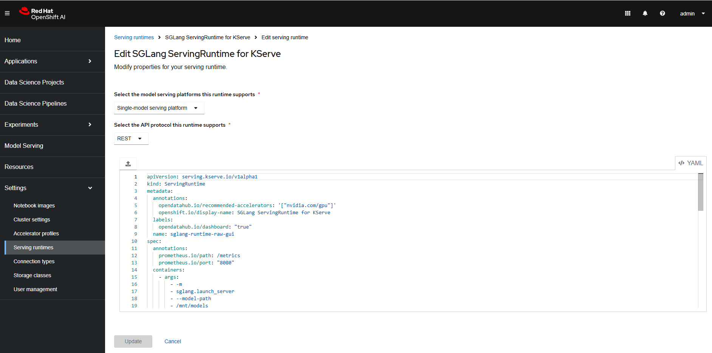

🔹使用该Runtime，部署DeepSeek模型

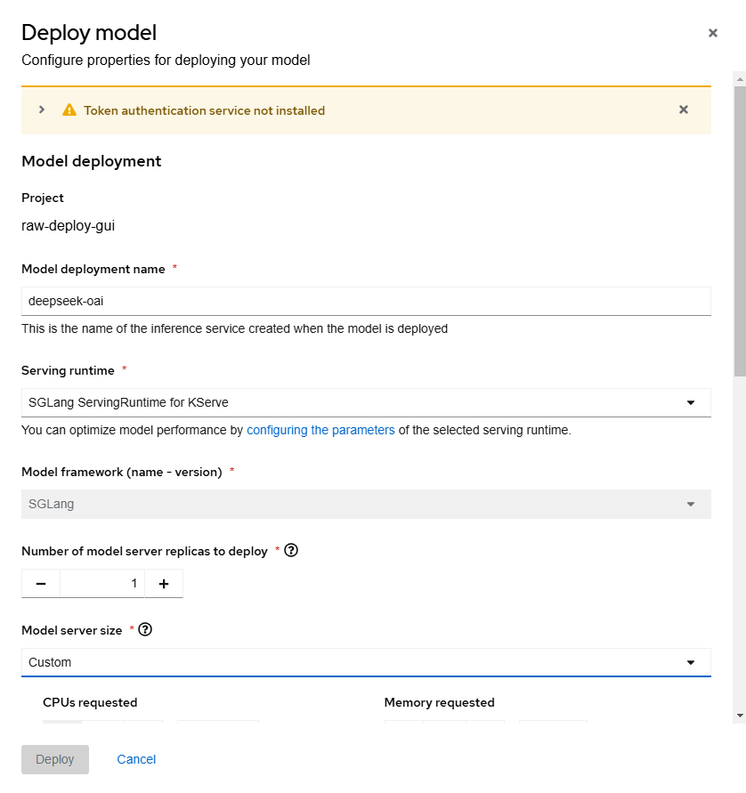

🔹选择刚才创建的Serving runtime，选择Model server size， 把CPUs和Memory设定为与大模型相对应的配置。

🔹其它的设置如下图所示，注意Connection的路径为刚才复制的S3的大模型存放路径：

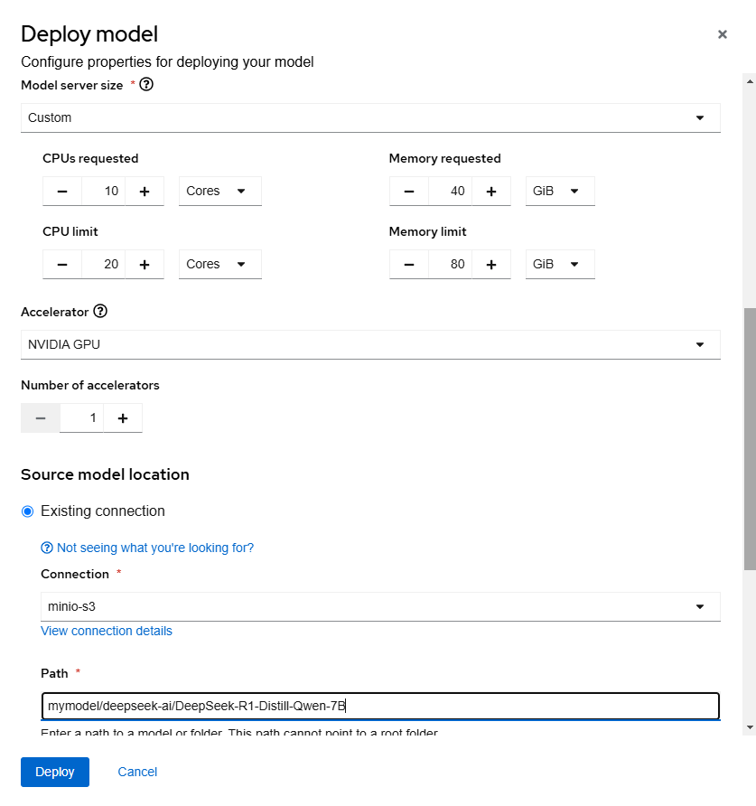

🔹点击部署，直到服务状态正常。

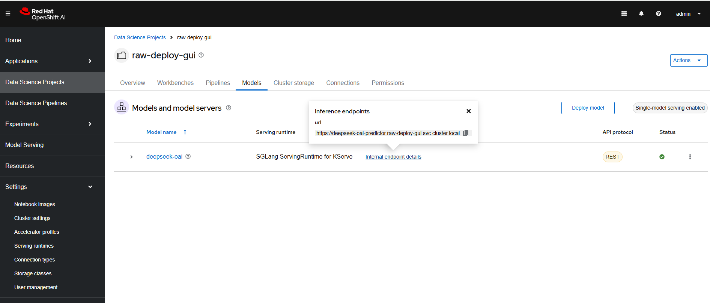

🔹还可以到OpenShift的后台，查看Pod的日志信息，可以看到模型已经正常加载。


🔹最后，创建必要的Route对象，供集群外访问，就可以了。

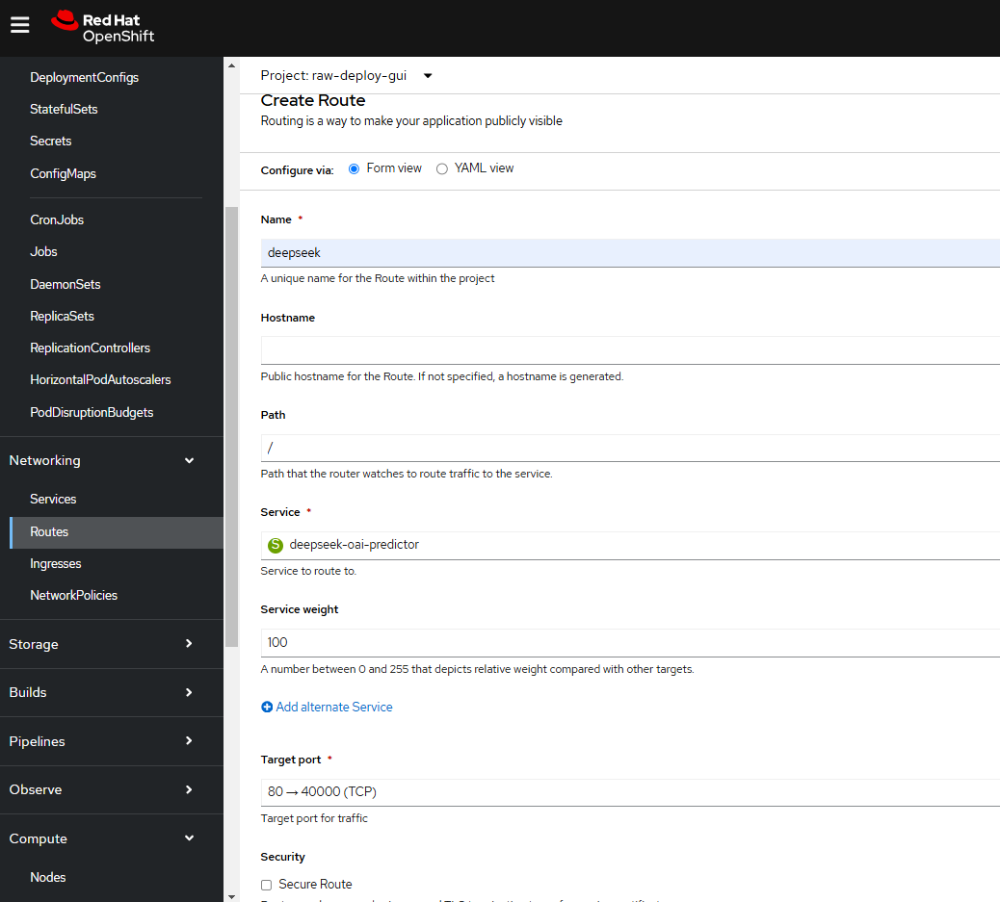

### 4.6 测试大模型推理

🔹最后，用以下命令测试一下推理可以正常工作。注意model参数值为/mnt/models

```
curl -k http://deepseek-raw-deploy-gui.apps.cluster-kh9h7.kh9h7.sandbox2957.opentlc.com/v1/completions \
-H "Content-Type: application/json" \
-d '{
    "model": "/mnt/models",
    "role": "user",
    "prompt": "what is openshift ai?"
}'
```

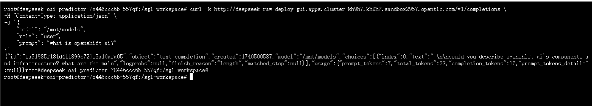

## 5. 部署进阶2： 多机多卡的分布式推理

在大模型（如 DeepSeek、Llama、GPT-4 等）推理和训练过程中，单个 GPU 的 **显存（VRAM）和计算能力** 往往无法满足需求。常见的并行技术有：

- **数据并行（Data Parallelism, DP）**：每个 GPU 计算相同的模型，但处理不同的数据样本。
- **流水线并行（Pipeline Parallelism, PP）**：将模型按层切分，不同 GPU 处理不同的层。
- **张量并行（Tensor Parallelism, TP）**：**将单个神经网络层的计算拆分到多个 GPU 上进行并行计算**。

张量并行特别适用于 **单个 GPU 无法容纳整个 Transformer 层的计算** 的情况，比如 **大模型推理（inference）或训练（training）时**。

在 **多机多卡推理** 场景下，**SGLang** 采用了 **张量并行（Tensor Parallelism, TP）**的方式，实现 **高效的分布式推理**。其底层利用 **NCCL（NVIDIA Collective Communications Library）** 进行 GPU 之间的数据通信。  **流水线并行（Pipeline Parallelism, PP）** 已经在Roadmap中提到了计划日程。

正如前面表格所示，671B的满血模型，一张显卡是无论如何都无法满足要求的，需要至少8张96G的H20，如果更低端的卡，更需要实现多机多卡的分布式部署。

以下步骤，从技术上实现大模型在2台机器上的分布式部署，因为资源紧张，还是以上述7B大模型为例。

🔹为当前project赋值特权用户

```
oc adm  policy add-scc-to-user privileged -z default -n deepseek-test
```

前期准备工作如“3. 在 OpenShift 上部署 SGLang + DeepSeek”章节的内容类似，提前准备好大模型以及SGLang镜像。

### 5.1 部署LeaderWorkerSet

LeaderWorkerSet用于在OpenShift集群上部署基于RoCE网络的SGLANG多节点推理服务。
LeaderWorkerSet（LWS）是一个Kubernetes API，旨在解决AI/ML推理工作负载的常见部署模式。一个主要用例是多主机/多节点分布式推理。
Sglang需要与Kubernetes上的LWS一起部署，用于分布式模型服务。关于LWS的安装，可详见如下链接：https://github.com/kubernetes-sigs/lws/blob/main/docs/setup/install.md

```
VERSION=v0.5.1
oc apply --server-side -f https://github.com/kubernetes-sigs/lws/releases/download/$VERSION/manifests.yaml
```

### 5.2 部署sglang LeaderWorkerSet

为了部署、调试方便，我们继续使用前面的准备大模型PV的方法，只不过，如果你的StorageClass不支持RWX，那么需要创建2个PV，并复制大模型文件进去。

创建2个PV的方法详见前面的3.2-（3）小节。注意以下yaml文件用到了2个PVC，分别是：ds-models-cache，ds-worker-models-cache

🔹sglang lws对象的部署文件内容如下：

```
apiVersion: leaderworkerset.x-k8s.io/v1
kind: LeaderWorkerSet
metadata:
  name: sglang
spec:
  replicas: 1
  leaderWorkerTemplate:
    size: 2
    restartPolicy: RecreateGroupOnPodRestart
    leaderTemplate:
      metadata:
        labels:
          role: leader
      spec:
        dnsPolicy: ClusterFirstWithHostNet
        containers:
          - name: sglang-leader
            image: quay.io/howang/sglang:latest
            securityContext:
              privileged: true
            env:
              - name: NCCL_IB_GID_INDEX
                value: "3"
              - name: LWS_WORKER_INDEX
                valueFrom:
                  fieldRef:
                    fieldPath: metadata.labels['leaderworkerset.sigs.k8s.io/worker-index']
            command:
              - python3
              - -m
              - sglang.launch_server
              - --model-path
              - /root/.cache/huggingface/DeepSeek-R1-Distill-Qwen-7B
              - --mem-fraction-static
              -  "0.93"
              - --torch-compile-max-bs
              - "8"
              - --max-running-requests
              - "20"
              - --tp
              - "2" # Size of Tensor Parallelism
              - --dist-init-addr
              - $(LWS_LEADER_ADDRESS):20000
              - --nnodes
              - $(LWS_GROUP_SIZE)
              - --node-rank
              - $(LWS_WORKER_INDEX)
              - --trust-remote-code
              - --host
              - "0.0.0.0"
              - --port
              - "40000"
            resources:
              limits:
                nvidia.com/gpu: "1"
            ports:
              - containerPort: 40000
            readinessProbe:
              tcpSocket:
                port: 40000
              initialDelaySeconds: 150
              periodSeconds: 10
            volumeMounts:
              - mountPath: /dev/shm
                name: dshm
              - name: model
                mountPath: /root/.cache/huggingface
        volumes:
          - name: dshm
            emptyDir:
              medium: Memory
          - name: model
            persistentVolumeClaim:
              claimName: ds-models-cache
    workerTemplate:
      spec:
        dnsPolicy: ClusterFirstWithHostNet
        containers:
          - name: sglang-worker
            image: quay.io/howang/sglang:latest
	    securityContext:
              privileged: true
            env:
            - name: NCCL_IB_GID_INDEX
              value: "3"
            - name: LWS_WORKER_INDEX
              valueFrom:
                fieldRef:
                  fieldPath: metadata.labels['leaderworkerset.sigs.k8s.io/worker-index']
            command:
              - python3
              - -m
              - sglang.launch_server
              - --model-path
              - /root/.cache/huggingface/DeepSeek-R1-Distill-Qwen-7B
              - --mem-fraction-static
              - "0.93"
              - --torch-compile-max-bs
              - "8"
              - --max-running-requests
              - "20"
              - --tp
              - "2" # Size of Tensor Parallelism
              - --dist-init-addr
              - $(LWS_LEADER_ADDRESS):20000
              - --nnodes
              - $(LWS_GROUP_SIZE)
              - --node-rank
              - $(LWS_WORKER_INDEX)
              - --trust-remote-code
            resources:
              limits:
                nvidia.com/gpu: "1"
            volumeMounts:
              - mountPath: /dev/shm
                name: dshm
              - name: model-worker
                mountPath: /root/.cache/huggingface
        volumes:
          - name: dshm
            emptyDir:
              medium: Memory
          - name: model-worker
            persistentVolumeClaim:
              claimName: ds-worker-models-cache
---
apiVersion: v1
kind: Service
metadata:
  name: sglang-leader
spec:
  selector:
    leaderworkerset.sigs.k8s.io/name: sglang
    role: leader
  ports:
    - protocol: TCP
      port: 40000
      targetPort: 40000
```

🔹 **LeaderWorkerSet 是一个 Kubernetes 自定义资源**，用于创建 **一组 Leader 和 Worker 节点**，适用于分布式 AI 计算。
🔹 **replicas: 1** 表示当前 LeaderWorkerSet 只创建 **一个 Leader-Worker 组**。

🔹 **size: 2** 表示 Leader 组内包含 **1 个 Leader + 1 个 Worker**（共 **2 个节点**）。

🔹 **privileged: true**：赋予 Pod 特权模式，可能是为了访问 GPU、InfiniBand 等硬件资源

🔹 **NCCL_IB_GID_INDEX**：用于 NCCL（NVIDIA Collective Communications Library） 的 InfiniBand 配置，优化 GPU 通信
🔹 **LWS_WORKER_INDEX**：从 Kubernetes Pod 元数据读取 Worker 索引，便于在多机分布式训练时正确初始化节点

🔹 **--mem-fraction-static 0.93**： 限制 GPU 内存占用为 93%，防止 OOM

🔹  **--torch-compile-max-bs 8**：最大批处理大小（batch size）= 8，优化推理吞吐量

🔹  --max-running-requests 20： 最多同时处理 20 个推理请求，避免过载

🔹  **--tp 2（Tensor Parallelism）**： 使用 2 路张量并行（TP），即模型权重在 2 块 GPU 上拆分计算

🔹  **--dist-init-addr $(LWS_LEADER_ADDRESS):20000**：  分布式初始化地址，用于 NCCL 训练

🔹  **--nnodes $(LWS_GROUP_SIZE)** ： 节点总数（Leader + Worker），用于多机多卡推理

🔹  **--node-rank $(LWS_WORKER_INDEX)**： 当前节点 ID，区分 Leader 和 Worker

🔹  -**-host 0.0.0.0 --port 40000**： 监听 40000 端口，提供 AI 推理服务

🔹如果一切正常，你会看到如下图一样的结果。

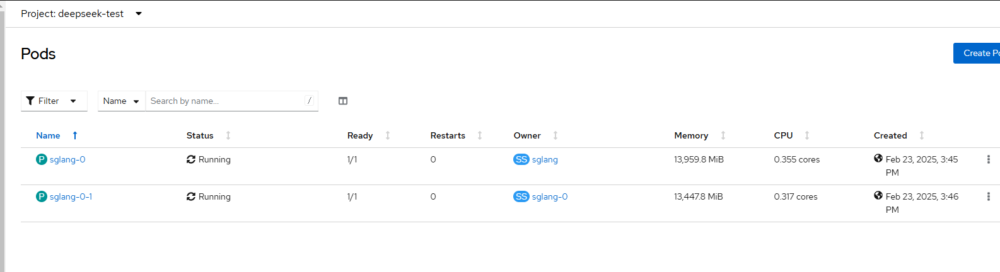

🔹检查leader服务状态，

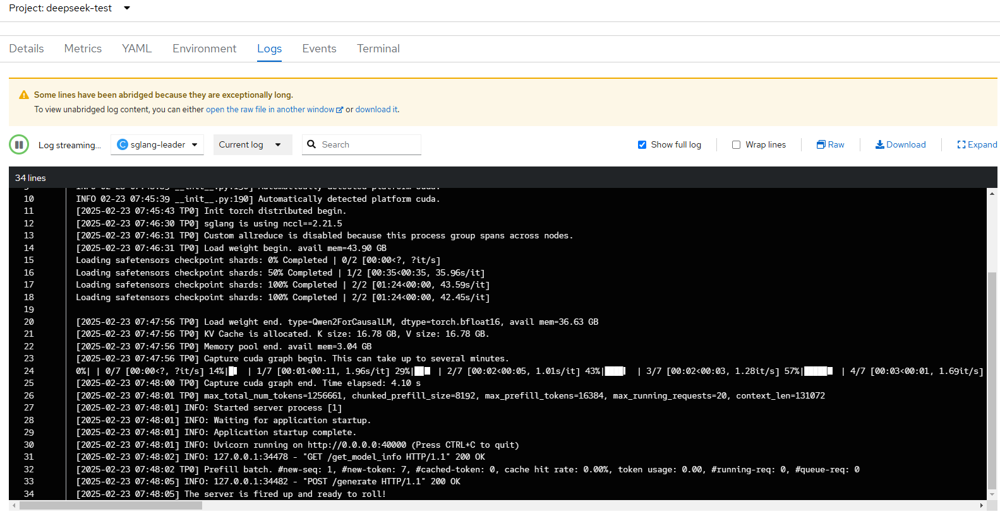

🔹检查worker服务状态

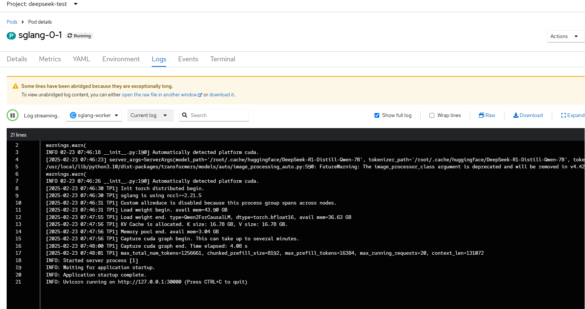

### 测试多节点分布式推理

```
curl http://sglang-leader.deepseek-test.svc.cluster.local:40000/v1/completions \
-H "Content-Type: application/json" \
-d '{
    "model": "DeepSeek-R1-Distill-Qwen-7B",
    "role": "user",
    "prompt": "What is the meaning of life?"
}'
```

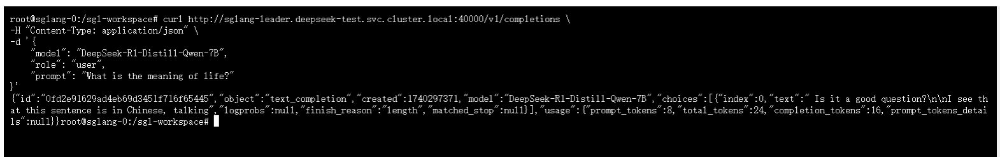


## 总结

本文介绍了如何在 OpenShift 和 OpenShift AI 上部署 SGLang + DeepSeek 大模型，并完成了以下步骤： 

✅ 在OpenShift部署大模型推理服务，实现多机多卡。适合所有想在OpenShift环境中进行AI大模型尝试的用户群体。
✅ 在OpenShift AI上，实现大模型推理服务的自动化部署。适合已在试用OpenShift AI，或者想增强已有OpenShift环境的AI能力的用户群体。
✅ 在OpenShift上实现张量并行式多机多卡的分布式推理。适合已经在OpenShift中实现了AI大模型业务，并希望进行规模化AI业务拓展的用户群体.

通过 OpenShift 的 Kubernetes 原生支持，你可以轻松实现 DeepSeek+SGLang 大模型推理部署，并利用 OpenShift AI 进行 GPU 加速和 MLOps 管理。希望本文对你有所帮助！

